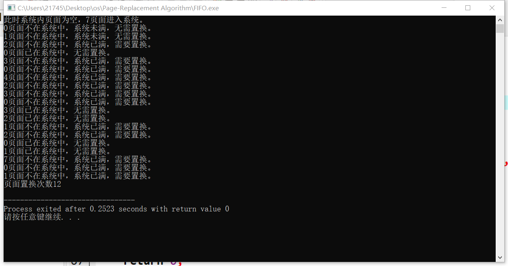
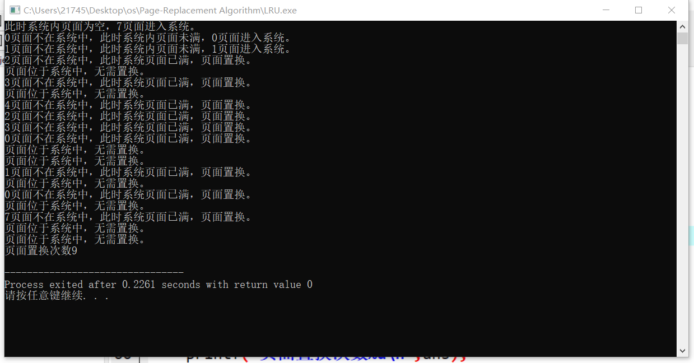

### 操作系统页面置换算法

在进程运行过程中，若其所要访问的页面不在内存，而需把它们调入内存，但内存已无空闲时间时，这时系统需要取出其中的某个页面，这需要一个算法来实现，这就是页面置换算法。

#### FIFO（先进先出的页面置换算法）

算法淘汰页面的依据是页面进入系统的时间，当需要页面置换时，每次选择当前进入系统最早的页面退出系统。算法实现是通过队列进行模拟的，先进先出很符合数据结构队列，判断当前队列中是否存在页面x时，我们需要遍历整个队列一遍，队列遍历的时间复杂度为$O(N)$。假设系统的容量为N，系统的页面序列长度为M，每次执行算法时我们都需要遍历队列，所以时间复杂度是$O(N*M)$。

#### LRU（最近最久未使用置换算法）

算法淘汰页面的依据是当前系统内页面在系统中的滞留时间，即每次系统会淘汰距离上一次使用最久的那个页面。算法的实现是通过栈来实现的，当一个页面进入系统中，最终该页面都会变成栈顶，如果该页面在栈中，将它从栈中删除，然后再重新入栈；如果栈满了，则需要删除栈底的元素，再将其入栈。类似于FIFO算法，我们每次都需要遍历栈。假设系统容量为N,系统的页面序列长度为M，它的时间复杂度为$O(N*M)$。

#### 程序的输入描述

```c++
3
7 0 1 2 0 3 0 4 2 3 0 3 2 1 2 0 1 7 0 1 -1
```

两个程序的输入是一致的。

输入为两行，第一行一个整数，表示系统的容量，第二行是一个以-1结尾的页面序列，空格隔开，-1表示输入的结束。

以上输入参考自课本

两个程序输入结果如下

FIFO



LRU



运行结果对比，FIFO执行页面置换12次，而LRU只置换了9次。

为了放大它们之间的差距我采用rand.cpp生成一组大数据再次进行测试

共有两万条的页面序列。结果为FIFO.out与LRU.out

**FIFO页面置换次数11364**

**LRU页面置换次数11321**

这是纯随机数的情况下，我对其进行过多次尝试，它们的差距都不大。

课本上的意思显然LRU算法笔FIFO算法要好，出现这个结果，可能因为我生成的是纯随机数，根据程序的局部性原理，实际的操作系统中，高频率使用的页面应该会多次出现，这更符合LRU算法的设计理念。